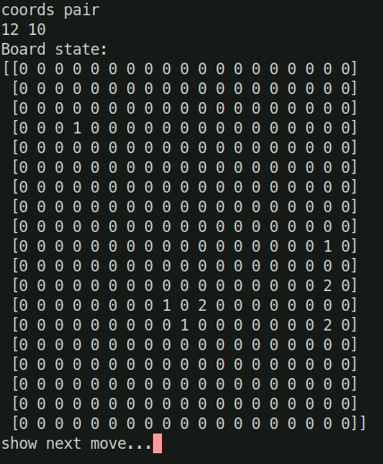

# ezGO
Deep learning Go (Baduk) bot using TensorFlow, 

Uses a 10-layer convolutional neural-network, design loosely following Alpha Go's policy network:
First a 5x5 Conv
Followed by 9 3x3 layers using ReLu

Training data used from KGS servers. .sgf format.

Simple terminal-text display, it will play against itself.
Lots of bugs to fix..

